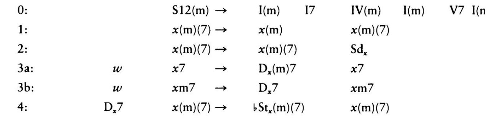
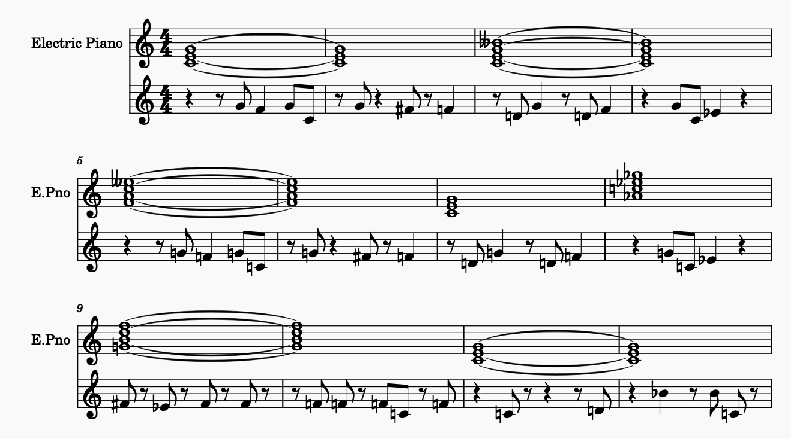

---
author:
- Jake Kerrigan, Milo Goldstein
date: February 2025 - 10 Hours
title: "Composition 1: Blues Harmony Generator"
---

# How To Run

To run Comp1.py you must have music21 installed in the active environment.
Comp1.py can be run in three modes:

1.  No flag is given (i.e. just python3 comp1.py) then the program will
    output a text-based representation of the generated 12-bar blues.

2.  If the -m flag is given then the program will attempt to play the
    12-bar blues using the system's default midi player.

3.  If the -s flag is given then the program will attempt to graphically
    display the sheet music.

Once you start the program you will be prompted to enter three settings:
key, number of rounds of derivations, and min chord length. After this,
the program will generate the 12-bar blues. Then, based on the flag
provided to the command line, it will output you the corresponding
format of the 12 bar blues.

# Description of Composition

Generating our composition took a combination of randomization and both
grammar-based and serialization-based approaches:\
\
The harmony used a modified implementation of Steedman's grammar in his
paper *A Generative Grammar for Jazz Chord Sequences*, which we learned
about in class. We modified this grammar's implementation based on our
previous knowledge on jazz blues progressions and trends within our
favorite jazz blues pieces. The last (two to) four bars of a jazz blues
are known as the piece's turnaround. This is often a sequence of,
potentially tritone substituted, 2-5-1's. In fact, much of that \"jazz
sound\" can be achieved by a combination of 2-5-1's, or their tritone
substitutions, regardles of where they exist in the piece. Thus, we kept
all rules directly implimenting 2-5's or their substitutions in our
code: rules 3 and 4, with 3 modified to be one single rule where the
quality of the dominant is dependent on the quality of x. We also kept
rules 1 and 2 since they demonstrate pretty classic blues tropes. Given
that faster changing harmonic rhythm tends towards the end of jazz blues
pieces (in both that turnaround section, and the bar before it which may
itsself contain a fast moving 2-5 transition into the turnaround), we
used an end-of-piece-skewed randomization approach to decide where to
apply derivations.\
\
The melody used a modified serialization-based approach to generate
rhythms and a randomized approach to generating pitches for each
rhythmic note. The serialization worked only on 5 different outputs
(quarter note, quarter rest, two eighth notes, eighth note & eighth
rest, eighth rest & eighth note). The prime, instead of containing one
of each rhythm, contained 16 rhythms randomly selected from our list of
5. From here, 5 transformations are applied on the Prime. Each
transformation is a random choice from one of the four class-learned
transformations. From there, pitches in the user-inputted key's
corresponding minor blues scale are applied to the previously-generated
rhythms.

# Visualization/Demonstration

<figure>
    

</figure>

Our composition uses the above grammar to come up with derivations to the
standard 12 bar blues harmony (as defined in rule 0). (Note we decided
to combine rules 3a and 3b into one rule and made the first chord of
the RHS minor 50 percent of the time) The below output represents 1
\"round\" of derivation in the key of C, where each round represents
applying each rule once to the current 12 bar blues phrase.

<figure>
    

    
</figure>

Unfortunately, some of the derivations can cancel each other out.
Derivations 3 and 4 both effectively delete a chord, so seeing where each
derivation was applied can be difficult. One clear example in the above
output is measure 8. This is an application of rule 4; we can see that
the program replaced the chord in measure 8 with the dominant flat
superTonic relative to the root of the following chord: G dominant, (or
tri-tone sub of the 5th of G). Rule 4 was applied here because the
following chord is a 7th chord and before application the replaced chord
must have been a dominant 5th of the G (D dominate) which was likely
generated by rule 3 (which generates 5-1s!)

# Reflection

Many blues songs contain melodies of the form (4 bars melody1) (4 bars
melody1) (4 bars melody2). Since this style emphasizes the
turnaround tonally for the listener, and it is a pleasing sound to us,
we implemented our melody in this fashion. In the future, having rules
about what notes 'should come next' based on past notes (i.e. following
the blue note with the fourth or fifth note of the minor clues scale)
may lend itself to more consistently 'nice' resolutions in the melody
than a randomized approach. Furthermore, using a repertoire of
chord-based scales to decide what the next melodic pitch should be would
provide a wider range of 'nice' sounds for our piece. This concept can
be taken to the nth degree where melodic pitches could be informed by
chord tones, possible scales, color notes, and the note-context
surrounding them. If we had infinite time, we'd do something like this,
which is akin to impro-Visor.

An improvement to the harmonization would be to change the
voicings/inversions of chords. Currently, all chords are in root
positions, but by changing that we could make the harmony sound less
angular and jumpy by making the space between each chord smaller.

# What Gave Us Trouble?

In general combining streams in music21 can be troublesome, overall our
workaround just involved flattening the stream before outputting it.
However, what gave us the most trouble in this assignment was trying to
implement applyDerive3. Specifically, the functionality to cut out two
chords from a larger stream and then insert in two new ones proved to
have multiple ways to mess up the overall stream. Especially because
seeing where the generation went wrong was very hard in testing with
multiple rounds of derivations. But after many sessions and rewrites, we
were able to get the function to behave correctly on every generation.
(But let us know if you come across any malformatted output)!

The roman.Roman chord subclass gave us some of trouble as well. The
notation for defining chords in the roman subclass is a bit more
extended than that of the chord subclass. In roman, symbols such as
\"b\" and the capitalization of the numeral(s) have an impact on the
chord. Also, symbols such as IV7 applied in different keys do not hold
the same context. Say we apply this in c major, we'll get an F major7
chord (since, diatonically, the e is natural in c major). If we used
iv7, though, we'd get F minor7 (with the b flat). If we wanted that b
flat in the original IV7, we could have done a few things (and there may
even be more ways to do this): IV7\[b7\] or IV-7. Both of these
variations give us the flat 7, as opposed to the major 7.
